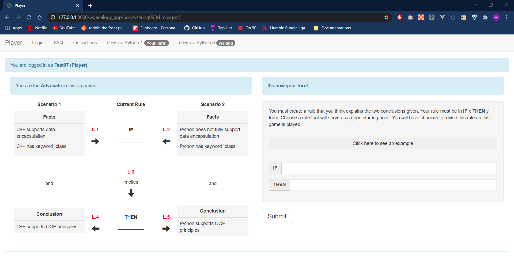

# warrant-game-analogy-winter2020

This is the second iteration of the Warrant Game - Analogy (WG-A) web app. This iteration was used for both studies conducted on December 2019 and January 2020.



## Development Setup (Ubuntu 18.04)

### Pre-requisites

| Service    | Description                                 | Host      | Port |
| ---------- | ------------------------------------------- | --------- | ---- |
| PostgreSQL | Database Server                             | localhost | 5432 |
| Redis      | Message Broker Server (for Django Channels) | localhost | 6379 |

Notes: Look in `Project/django_project/settings.py` (lines 86-88) to find the exact PostgreSQL credentials needed.

### Steps

1. Create a Python virtual environment
```shell
python3 -m virutalenv env
```

2. Activate the newly created virtual environment
```shell
source env/bin/activate
```

3. Install this project's dependencies
```shell
pip install -r requirements.txt
```

4. Navigate inside the Django project directory
```shell
cd Project/
```

5. Create necessary database tables
```shell
python manage.py migrate
```

6. (Optional) Collect static files into one location
```shell
python manage.py collectstatic
```

7. Create superuser account
```shell
python manage.py createsuperuser
```

8. Run server
```shell
python manage.py runserver
```

9. Login using `127.0.0.1:8000/admin`

10. View the moderator interface at `127.0.0.1:8000/wganalogy_app/moderator/`

11. View the participant interface at `127.0.0.1:8000/wganalogy_app/user/`

## Notes
+ The instructional video for the experimental case is too large for GitHub.
